# Unity3D: An Introduction

---

**Unity** is a cross-platform game engine developed by Unity Technologies, first announced and released in June 2005. As of 2018, the engine had been extended to support more than 25 platforms. The engine can be used to create three-dimensional, two-dimensional, virtual reality, and augmented reality games, as well as simulations and other media context/experiences. Unity has also been adopted by industries outside video gaming, such as film, automotive, architecture, engineering and construction, scientific research, and interactive media art.

Use the hashtag **#madewithunity** to checkout what users make with it.

Download Unity [here](https://unity3d.com/get-unity/download).

---

## Unity Hub
The **Unity Hub** is a management tool that you can use to manage all of your Unity projects. Use the Hub to manage multiple installations of the Unity Editor along with their associated components, create new Projects, or open existing Projects.

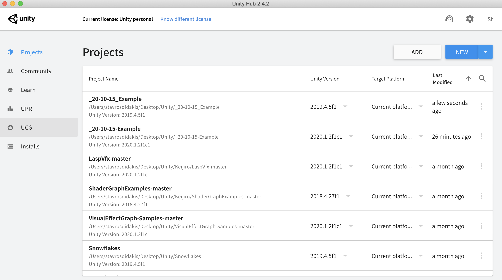

To create a new project we use the **New** button on the right top corner. At this point we need to specify the Unity Editor version that we want. We can set this in the **Installs** menu option on the left side of the window. Necessary components would include your operating system (i.e. Windows Build Support, or Mac Build Support) as well as the version of Unity Editor. For now, we can use the current version (2020 or 2019), but in some occasions older versions would be needed, especially if we want to work with older projects, repositories, or libraries.


When starting a new project in Unity Hub we are offered the option to use a preset template, such as for a **2D/3D environment**, **High Definition Render Pipeline**, a **Universal Render Pipeline**, and others. Differences between these options are to enable preset settings that assist the development process (such as rendering quality, shaders supports, etc.). In this occasion, we will be using the **High Definition RP** template.

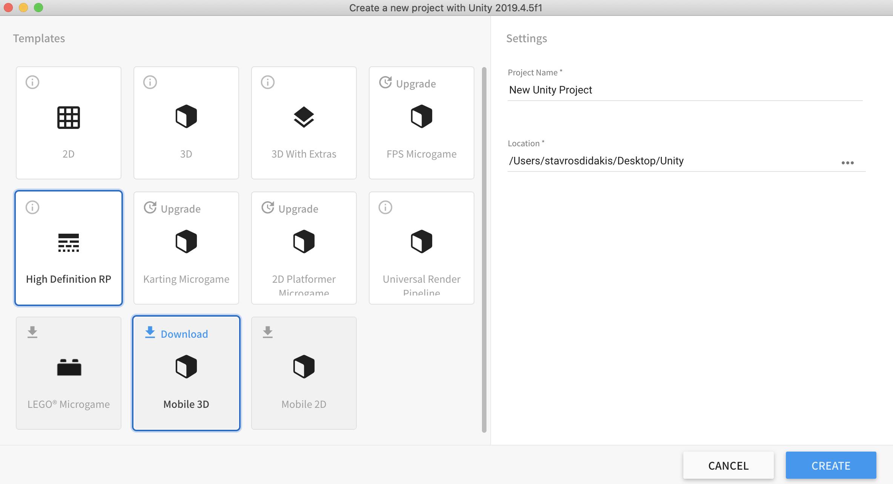

---

## Unity Editor


When the Editor launches the project, we find the main user interface that contains parts for viewing the project's hierarchy, main scene view, inspector for various elements/GameObjects (such as cameras, or lights), as well as the project's main directory that can contain assets like 3D models, or materials.

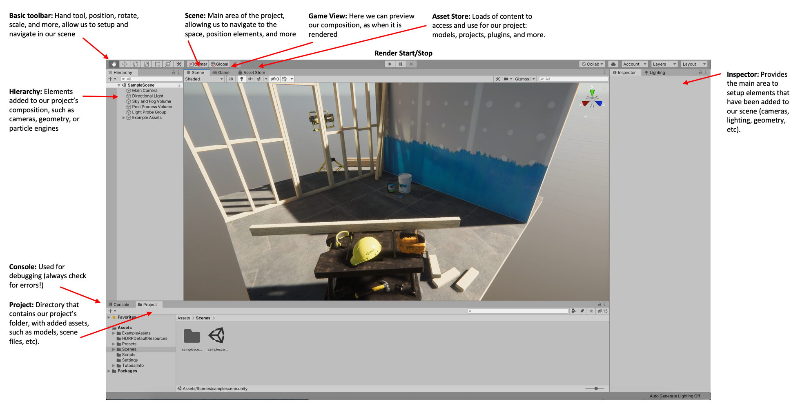

When an item/GameObject has been selected on the hierarchy tab (i.e. camera) we can configure its settings on the **Inspector**. Here, we can change the camera's position, rotation, lenses, etc. The changes can be previewed on the Scene, Game, or main render window. On the Inspector, we can also easily activate/deactivate elements added to our composition (GameObjects or Components - such as physics engines, VFX, etc).

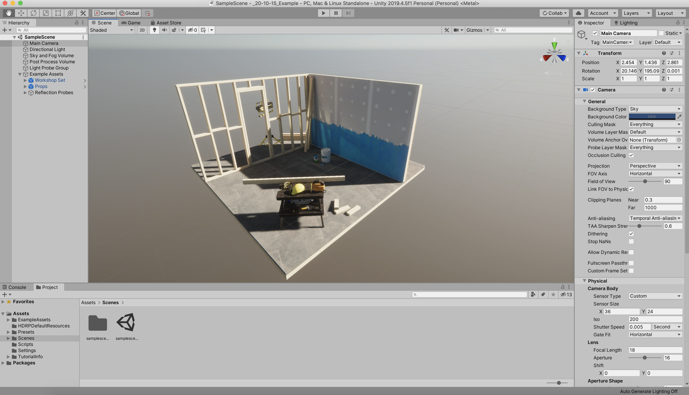

To add a new **GameObject**, we can right click on the **Hierarchy** panel. Here, we can add a cube, and set its new preferences on the Inspector, such as size, position, rotation.

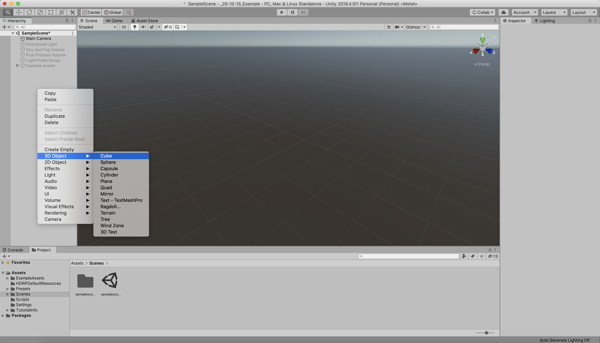

In addition to this, we can add a material to the GameObject's surface. In the project panel, we can find a few preset materials to try on (or just use our own).

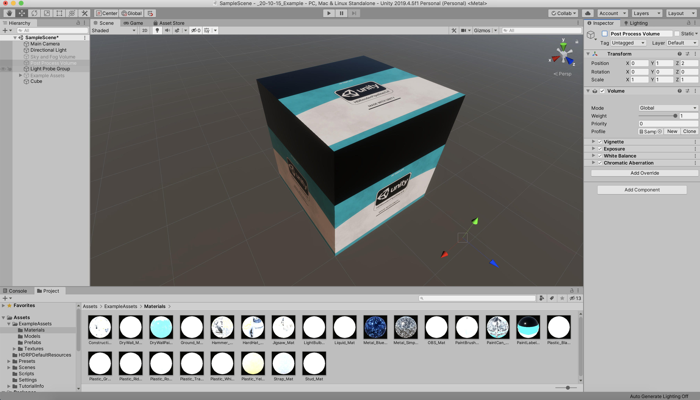

---

By continuing using the same steps we can develop the geometries that we want, as in the following example where a container has been created, by using 4 different planes, positioned and rotated accordingly.

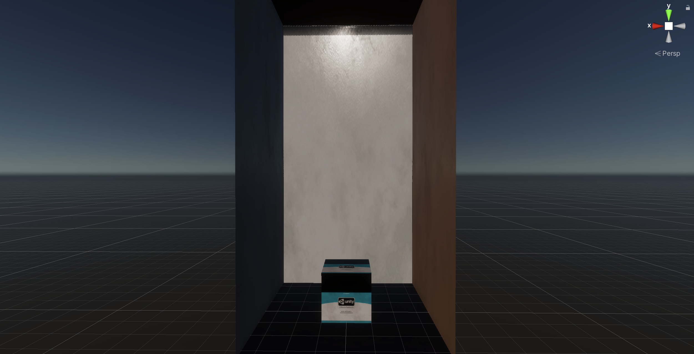

---

## Adding 3D Models

In Unity we can import a wide range of 3D models, besides the ones that we can create on our own. Exported files from Blender, Maya, 3DsMax and many other platforms, can easily be added in Unity - suggested filetype is .FBX ([more info on filetypes here](https://docs.unity3d.com/Manual/3D-formats.html)). There are many online repositories that provide 3D models (copyright-free in some cases too):
- https://assetstore.unity.com/
- https://www.turbosquid.com/
- https://sketchfab.com/
- https://free3d.com/
- https://www.thingiverse.com/

If you identify a model that you would like to use (and that you are authorised to use it) you can simply drag-n-drop the folder on the project's directory in the Unity Editor. Following that, we can add the model into the Scene by dragging the FBX file into it.

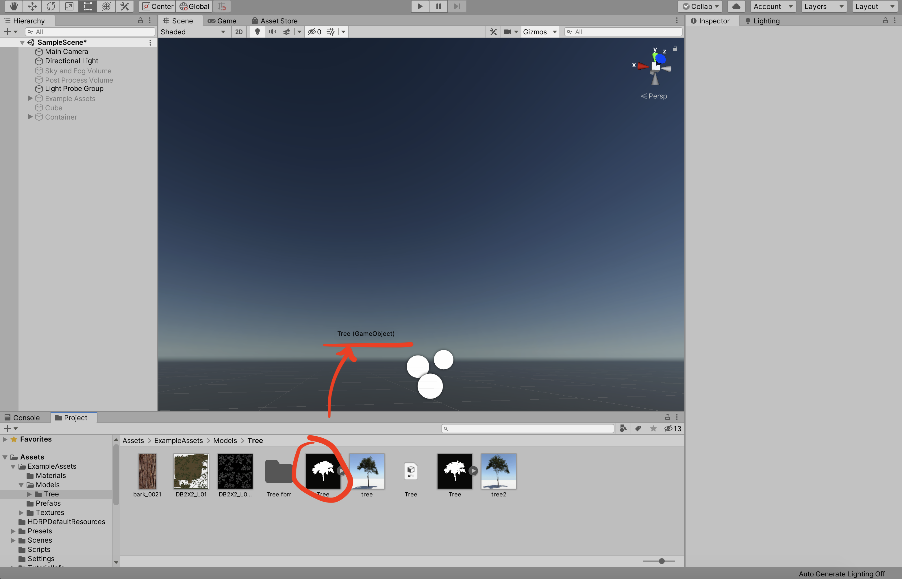

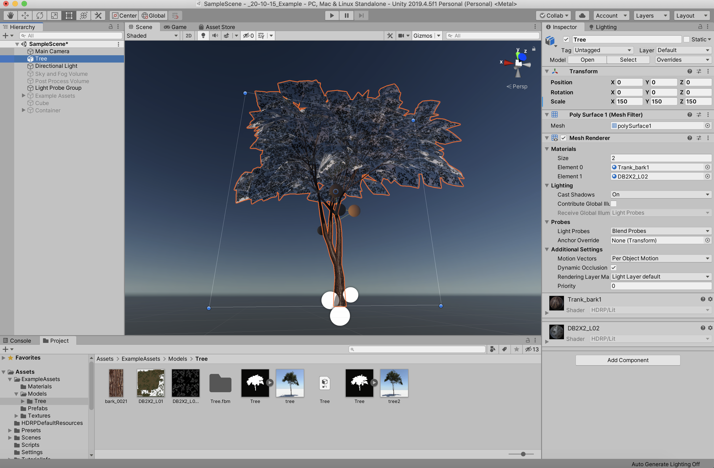

Follow [this link](https://docs.unity3d.com/Manual/ImportingModelFiles.html), and [this](https://docs.unity3d.com/560/Documentation/Manual/HOWTO-importObject.html) to know more about importing models in Unity.

---

## Scripting

To develop a real-time (or interactive action) we can proceed with the development of a script in C#, which is the official coding language for Unity. You may find below a few basic references:

- [Variables](https://learn.unity.com/project/c-survival-guide-variables?uv=2018.4&courseId=5cf06bd1edbc2a58d7fc3209)
  - Variable types in Unity
  - Declare variables
  - Use variables
  - Variable convert


- [If Statement](https://learn.unity.com/project/c-survival-guide-if-statements?uv=2018.4&courseId=5cf06bd1edbc2a58d7fc3209)
  - If statement syntax
  - || and && operators to connect conditionals
  - If / else if / else


- [Switch Statement](https://learn.unity.com/project/c-survival-guide-switch-statements?uv=2018.4&courseId=5cf06bd1edbc2a58d7fc3209)
  - Switch statement syntax
  - Use switch statement to switch between more than 2 states


- [Array](https://learn.unity.com/project/c-survival-guide-arrays?uv=2018.4&courseId=5cf06bd1edbc2a58d7fc3209)
  - Create Array
  - Assign array values


- [Loop](https://learn.unity.com/project/c-survival-guide-loops?uv=2018.4&courseId=5cf06bd1edbc2a58d7fc3209)
  - For-loop syntax
  - Foreach loop syntax


- [Function](https://learn.unity.com/project/c-survival-guide-functions-and-methods?uv=2018.4&courseId=5cf06bd1edbc2a58d7fc3209)
  - Create a function
  - Function with parameters
  - Function with return value

In this case, we will proceed with a basic example, which is going to continuously rotate our 3D object over time. To do this, we need to:
1. Select the GameObject we want to attach the script to (Tree)
2. Add Component in the GameObject's Inspector, which then the attached script will appear on the panel.
3. The script will be saved in the project's directory.
4. By double-clicking the script, we can edit it in our code editor (Visual Studio, or Atom for example).

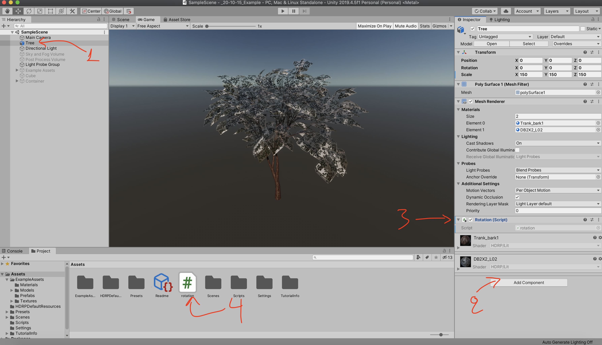

The code below demos the rotation function that we apply to the GameObject. Only two lines of code are needed here to accomplish this. The first line (contained within the **rotation** class) defines a float variable that has a value of 3 - this represents how many rotations per minute we want to have. The other line, is contained inside the nested function **Update**, which is updated on every frame when our project is executed. Here, we use the transform keyword, which is defined in [Unity's documentation](https://docs.unity3d.com/ScriptReference/Transform.html) as a way to access aspects such as position, scale, and rotate. From transform, we use the **.rotation** to access only the property of rotation. This property uses the following syntax:

```
public void Rotate(float xAngle, float yAngle, float zAngle, Space relativeTo = Space.Self);
```

This means that in order to rotate the object on the Y-axis, we should consider creating a continuously-changed variable that exists inside the second parameter (float yAngle), leaving the first and third parameters at zero (no rotation). Thus, the parameters are as follows:
- **float xAngle** : 0f (no rotation, the f represents that the number is a float)
- **float yAngle** : 6f \* rotationsPerMinute \* Time.deltaTime (is the formula that will give us 3 rotations per minute)
- **float z Angle** : 0f (no rotation)

Find [in this link](https://docs.unity3d.com/ScriptReference/Transform.Rotate.html?_ga=2.143343664.402392353.1602567659-770391429.1595586040) more details about the rotate function from Unity's Documentation page.

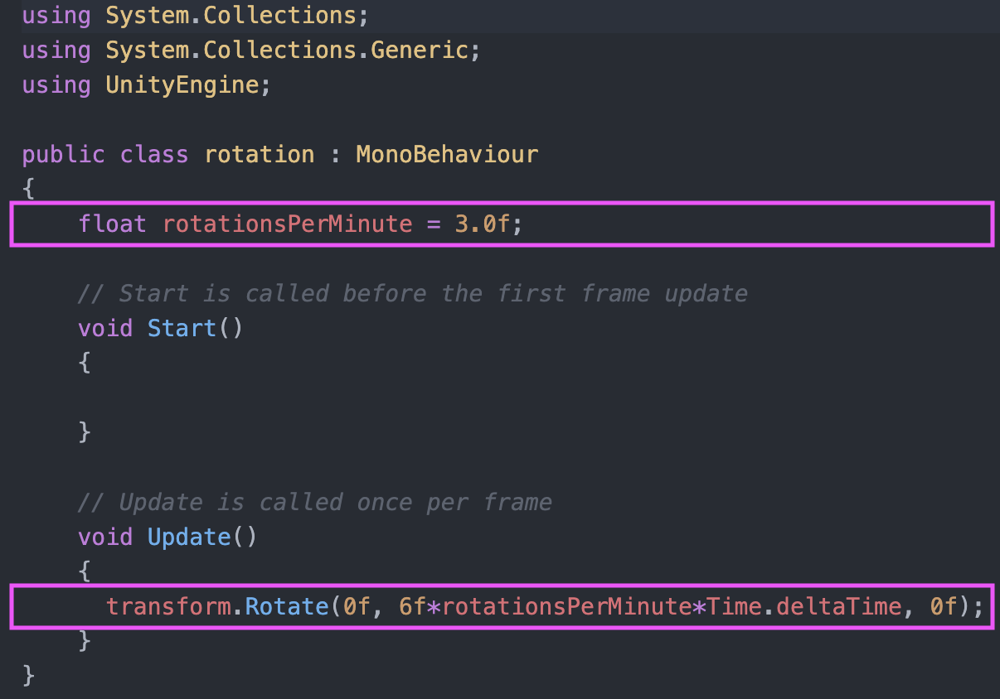
